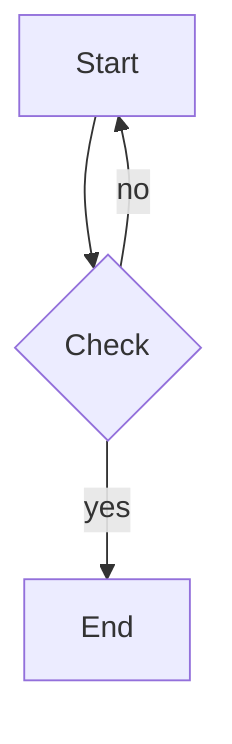

# Liepress

[](https://crates.io/crates/liepress)
[](https://docs.rs/liepress)
[](https://github.com/zzzdong/liepress/actions)
[](https://github.com/zzzdong/liepress)

A Rust implementation of a Markdown/HTML to PDF/SVG/PNG/DOCX document generator with CSS styling support.

## Features

- **Markdown to PDF / SVG / PNG / DOCX** — Convert Markdown documents into multiple output formats
- **CSS Styling** — Full CSS selector and property support via built-in stylesheet, external CSS files, or inline `<style>` tags in Markdown
- **GFM Support** — GitHub Flavored Markdown including tables, task lists, strikethrough, code blocks with language tags
- **Mermaid Diagrams** — Render fenced `mermaid` code blocks as diagrams (flowchart, sequence, class, state, ER, pie, gitgraph, timeline)
- **Charts** — Render fenced `liecharts` code blocks (ECharts-style JSON) as charts
- **Auto Font Detection** — Automatically detects document language (Chinese, Japanese, Korean, Latin) and recommends matching fonts
- **Page Layout** — A4 default, configurable page size/margins via `@page` CSS rules, auto pagination with widow/orphan control
- **Header & Footer** — Configurable page headers (with separator line) and footers with page number templates `{page}` / `{total}`
- **Hyperlinks** — Clickable links in PDF output, works across line breaks
- **Tables** — Column-width auto-sizing, cross-page splitting, header/alternate row styling
- **Images** — Auto-scaling, alt text captions, PNG/JPEG/GIF/WebP support
- **Code Blocks** — Monospace font, syntax highlighting, cross-page support

## Quick Start

### CLI

```bash
# Convert to PDF (default)
liepress -i document.md -o document.pdf

# Convert to SVG, PNG or DOCX
liepress -i document.md -o document.svg -f svg
liepress -i document.md -o document.png -f png
liepress -i document.md -o document.docx -f docx

# Apply custom CSS stylesheet
liepress -i document.md -o document.pdf -s style.css

# Customize header and footer
liepress -i input.md -o output.pdf --header "Project Report"
liepress -i input.md -o output.pdf --footer "Page {page} / {total}"

# Remove default page number
liepress -i input.md -o output.pdf --no-page-number

# Custom page size and margins
liepress -i input.md -o output.pdf -p A5 --margin 24pt

# Strict CSS parsing (fail on errors)
liepress -i input.md -o output.pdf -S
```

### Rust API

```rust
use liepress::{markdown_to_pdf, ConvertOptions};

let md = "# Hello\n\nThis is a **Markdown** document.";

let pdf = markdown_to_pdf(
    md,
    &ConvertOptions::new()
        .with_font_family(&["Noto Sans CJK SC", "sans-serif"])
        .with_css("h1 { color: #c00; }")
        .with_header("My Document")
        .with_footer("- {page} -"),
)?;
```

### CSS in Markdown

```markdown
<style>
body { font-family: "Noto Sans CJK SC", serif; }
h1 { color: #c00; border-bottom: 1px solid #ccc; }
@page {
    margin: 36pt 54pt;
    header: "Project Report";
    footer: "Page {page} / {total}";
}
</style>

# Title

Document content here...
```

### Diagrams and Charts

Use fenced code blocks with a `mermaid` or `liecharts` language tag:

````markdown


```liecharts
{"title":{"text":"Sales"},"xAxis":[{"type":"category","data":["Jan","Feb","Mar"]}],"yAxis":[{"type":"value"}],"series":[{"type":"bar","data":[120,200,150]}]}
```
````

## Installation

```bash
cargo install liepress
```

Or build from source:

```bash
git clone https://github.com/zzzdong/liepress.git
cd liepress
cargo build --release
./target/release/liepress -i input.md -o output.pdf
```

## Documentation

- [Design Document](docs/design.md) — Architecture, module design, and development guide
- `liepress --help` — CLI usage and all available options

## License

Licensed under either of:

- [MIT license](LICENSE-MIT)
- [Apache License, Version 2.0](LICENSE-APACHE)

at your option.
