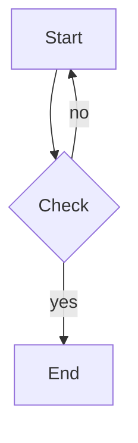
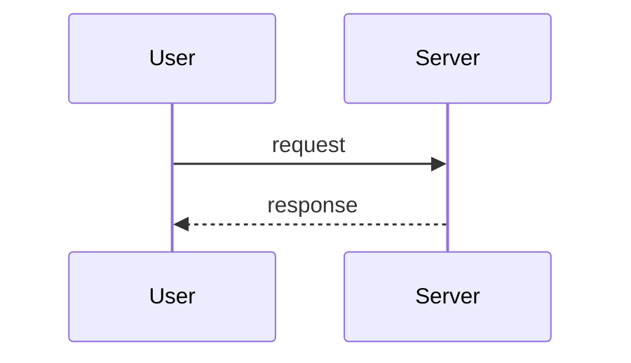

# liepress

**liepress** 是一个基于 Rust 的 Markdown / HTML 文档转换工具，支持 CSS 样式定制，
可将文档输出为 **PDF / SVG / PNG / HTML / DOCX** 五种格式。

本文件本身即一份演示文档：分别以五种格式输出，可直观对比各后端的渲染表现
（排版、分页、语法高亮、图表嵌入等）。

- 作者：zzzdong
- 仓库：<https://github.com/zzzdong/liepress>
- 许可：MIT OR Apache-2.0
- 当前版本：v0.2.0

> 本文件用于端到端验证 liepress 的生成能力，同时如实记录项目的实际功能边界。

---

## 目录

- [1. 安装与快速开始](#1-安装与快速开始)
- [2. 文本样式](#2-文本样式)
- [3. 链接、图片与脚注](#3-链接图片与脚注)
- [4. 引用与列表](#4-引用与列表)
- [5. 代码块语法高亮](#5-代码块语法高亮)
- [6. 表格](#6-表格)
- [7. 定义列表](#7-定义列表)
- [8. 居中容器与内联样式](#8-居中容器与内联样式)
- [9. 页面配置（@page 与命令行）](#9-页面配置page-与命令行)
- [10. 混合排版示例](#10-混合排版示例)
- [11. 图表（liecharts）](#11-图表liecharts)
- [12. 流程图（mermaid）](#12-流程图mermaid)
- [13. 项目实际情况记录](#13-项目实际情况记录)

---

## 1. 安装与快速开始

从源码构建：

```bash
git clone https://github.com/zzdong/liepress
cd liepress
cargo build --release
```

> 说明：crates.io 上的包名为 `liepress`，也可用 `cargo install liepress` 安装。

准备一个 Markdown 文件 `doc.md`，然后运行：

```bash
# 输出格式由扩展名推断
liepress -i doc.md -o doc.pdf

# 也可用 -f 显式指定格式
liepress -i doc.md -o doc.svg -f svg
liepress -i doc.md -o doc.png -f png
liepress -i doc.md -o doc.docx -f docx

# 从标准输入读取、写入标准输出
cat doc.md | liepress -i - -o - -f pdf > doc.pdf
```

liepress 会根据 Markdown 内容与 CSS 样式生成文档；输出格式由输出文件扩展名
（`.pdf` / `.svg` / `.png` / `.html` / `.docx`）推断，也可用 `-f` 显式指定。
输入文件为 `-` 时从 stdin 读取，输出为 `-` 时写入 stdout。

标准输入场景需额外用 `-F/--from` 指明输入格式：

```bash
cat doc.md | liepress -i - -o - -F markdown -f pdf > doc.pdf
```

---

## 2. 文本样式

普通段落文本。**加粗文本**，*斜体文本*，***加粗斜体***，~~删除线文本~~。

行内 `code` 和行内代码块 `let x = 1;`。

这是 <span style="color: red;">红色 span 文字</span>，<span style="font-weight: bold;">加粗 span</span>，
<span style="font-size: 16pt;">放大字号 span</span>，<span style="text-decoration: line-through;">span 删除线</span>，
<span style="background-color: #ffffcc;">黄色背景 span</span>。

---

## 3. 链接、图片与脚注

[liepress 仓库](https://github.com/zzdong/liepress)

带标题的链接：[GitHub](https://github.com/zzdong/liepress "liepress 项目主页")

> 注：liepress 支持本地图片文件（相对 / 绝对路径）与 `data:` URI（base64 内联），
> 但不支持远程 URL 图片（需先下载为本地文件或 data URI）。将图片放在 Markdown 同级
> 或子目录中相对引用即可。

本地图片示例：


脚注示例：liepress 的 PDF 后端会收集脚注并在文末生成带锚点跳转的脚注区¹。
点击正文的角标可跳转到脚注定义²。

---

## 4. 引用与列表

多层嵌套引用块：

> liepress 支持嵌套引用块。
>
> > 引用内可以包含 **格式化文本**、`代码` 和 [链接](https://example.com)。
> >
> > > 三层嵌套引用也支持。

无序列表：

- PDF 输出（基于 krilla）
- SVG 输出（经 to_scene 转 `lievisual::Scene`，由 `SvgRenderer` 序列化为 XML，默认 72 DPI）
- PNG 输出（经 to_scene 转 `lievisual::Scene`，由 `VelloPixmapRenderer` 光栅化，默认 150 DPI）
  - 默认 150 DPI
  - 长图不分页

有序列表：

1. 解析 Markdown 为 AST
2. 应用 CSS 样式解析
3. 布局引擎生成文档树
4. 渲染后端输出目标格式

任务列表：

- [x] Markdown 解析
- [x] PDF / SVG / PNG / HTML / DOCX 输出
- [x] 代码块语法高亮（PDF / SVG / PNG）
- [x] 图表渲染（liecharts）
- [x] 流程图渲染（mermaid）
- [x] 代码块 / 长段落跨页分页
- [x] PDF 大纲书签与脚注跳转
- [ ] 数学公式（暂缓）
- [ ] 远程 URL 图片（需引入较大依赖）

---

## 5. 代码块语法高亮

无语言标识的代码块（退化为单色等宽）：

```
echo "Hello, liepress!"
```

Rust 代码块（高亮）：

```rust
use std::fs;

use liepress::{ConvertOptions, PageConfig, markdown_to_pdf};

fn main() {
    let md = "# Hello\nThis is **liepress**.";
    let options = ConvertOptions::default().with_page_config(PageConfig {
        width: Some(210.0),
        height: Some(297.0), // A4 纵向
        ..PageConfig::default()
    });

    let pdf = markdown_to_pdf(md, &options).unwrap();
    fs::write("output.pdf", pdf).unwrap();
}
```

Python 代码块（高亮）：

```python
from pathlib import Path

def build(md: str, out: str) -> None:
    """调用 liepress 库（Rust）生成 PDF。"""
    pdf = liepress_convert(md)        # 假设存在 Python 绑定
    Path(out).write_bytes(pdf)
    print(f"saved {out}")
```

JavaScript 代码块（高亮）：

```javascript
import { convert } from "liepress";

const md = "# Hello\nThis is **liepress**.";
const pdf = convert(md, { format: "pdf" });
await Bun.write("output.pdf", pdf);
```

> 语法高亮在文档层完成（基于 syntect，使用 `base16-ocean.dark` 暗色主题），
> 预排版为带颜色的文本行，PDF / SVG / PNG 后端直接消费，因此对三种位图 / 矢量输出
> 均生效。未知语言退化为单色等宽文本。HTML / DOCX 后端为流式序列化、未接入该高亮，
> 代码块保持单色。

---

## 6. 表格

| 输出格式 | 渲染后端 | 状态 | 优先级 |
|:--------|:---------|:----:|:------:|
| PDF     | krilla   | ✅ 完成 | 高 |
| SVG     | lievisual `SvgRenderer`（to_scene→Scene→XML） | ✅ 完成 | 中 |
| PNG     | lievisual `VelloPixmapRenderer`（to_scene→Scene→像素） | ✅ 完成 | 低 |
| HTML    | 语义序列化 | ✅ 完成 | 中 |
| DOCX    | docx-rs   | ✅ 完成 | 低 |

表格支持跨页拆分（PDF 后端在分页时自动续表头）。

---

## 7. 定义列表

术语与定义可用定义列表表示：

`ConvertOptions`
: 顶层转换配置，包含 CSS、页面尺寸、字体、严格模式等选项。

`PageConfig`
: 页面几何参数（宽、高、边距），默认 A4 纵向。

`ResourceResolver`
: 资源解析器，负责把相对路径图片解析为内联字节（data URI）。

---

## 8. 居中容器与内联样式

<center>liepress</center>

内联 `<style>` 标签定义的类：

<style>
.highlight {
    background-color: #ffffcc;
    padding: 2pt 4pt;
    border-radius: 2pt;
}
.warning {
    color: #cc0000;
    font-weight: bold;
}
.tagline {
    color: #4a90d9;
    font-style: italic;
    font-size: 14pt;
}
</style>

自定义样式测试：<span class="highlight">高亮文本</span>，<span class="warning">警告文本</span>，
<span class="tagline">styled tagline</span>。

---

## 9. 页面配置（@page 与命令行）

页面几何（尺寸、边距、方向）可用 Markdown 内联 `<style>` 中的 `@page` 规则声明，
也可通过命令行参数覆盖。

`@page` 支持 `size`（命名尺寸 A3 / A4 / A5 / Letter / Legal / Tabloid，可附加 `landscape` / `portrait`）
与 `margin`（含四边简写）：

```html
<style>
@page {
    size: A4;
    margin: 36pt 54pt;   /* 上下 36pt，左右 54pt */
}
</style>
```

命令行同样可指定页面尺寸与边距（单位支持 pt / mm / cm / in），并支持横向：

```bash
# A5 页面 + 统一边距
liepress -i doc.md -o doc.pdf -p A5 --margin 24pt

# 自定义宽高（横向）
liepress -i doc.md -o doc.pdf --page-width 297mm --page-height 210mm --landscape
```

页眉与页脚通过命令行设置，支持 `{page}`（当前页）与 `{total}`（总页数）占位符；
默认页脚显示页码，`--no-page-number` 可移除：

```bash
liepress -i doc.md -o doc.pdf \
  --header "项目报告" \
  --footer "第 {page} / {total} 页"

# 移除默认页码
liepress -i doc.md -o doc.pdf --no-page-number
```

> 注：`@page` 仅解析 `size` 与 `margin`；页眉 / 页脚目前由命令行参数控制。

字体方面，liepress 默认开启**自动字体探测**：根据文档语言选择字体（中文 → 仿宋 FangSong），
可用 `--no-auto-font` 关闭并回退到 `with_font_family` / CSS `font-family` 指定的字体。

---

## 10. 混合排版示例

这是 **加粗**、*斜体*、`代码`、<span style="color: red;">红色文字</span> 和
[链接](https://example.com) 混合在一起的段落。

> 引用块中混合 **格式化文本**、<span style="color: blue;">蓝色 span</span> 和 `行内代码`。

- **粗体列表项** 包含 <span style="background: #eee;">高亮 span</span>
- *斜体列表项* 包含 ~~删除线文本~~
- 普通列表项包含 `行内代码`

SVG 输出结构示意（长图，不分页）：

```svg
<svg width="595" height="842" xmlns="http://www.w3.org/2000/svg">
  <text x="50" y="80" font-size="24" font-weight="bold">Hello</text>
  <text x="50" y="120" font-size="10.5">This is liepress.</text>
</svg>
```

---

## 11. 图表（liecharts）

> `charts` 为默认 feature（见 §13），默认构建即包含 `liecharts`；以 `--no-default-features`
> 构建时退化为普通 JSON 高亮。

使用 ` ```liecharts ` 代码块，块内为 ECharts 风格 JSON 配置，自动渲染为图片并居中嵌入：

```liecharts
{
  "title": { "text": "月度销售额" },
  "tooltip": { "trigger": "axis" },
  "xAxis": [{ "type": "category", "data": ["1月", "2月", "3月", "4月"] }],
  "yAxis": [{ "type": "value" }],
  "series": [{ "type": "bar", "name": "销售额", "data": [120, 200, 150, 80] }]
}
```

可通过 info string 覆盖尺寸与主题：` ```liecharts width=640 height=360 theme=dark `

```liecharts width=640 height=360 theme=dark
{
  "title": { "text": "折线示例" },
  "xAxis": [{ "type": "category", "data": ["A", "B", "C"] }],
  "yAxis": [{ "type": "value" }],
  "series": [{ "type": "line", "data": [3, 7, 2] }]
}
```

非法 JSON 会软降级为带错误注释的代码块，不会中断整篇渲染：

```liecharts
{ "this is": not valid json
```

---

## 12. 流程图（mermaid）

> `mermaid` 为默认 feature（见 §13），默认构建即包含 `liemermaid`；以 `--no-default-features`
> 构建时退化为普通文本高亮。

使用 ` ```mermaid ` 代码块，块内为 Mermaid DSL 文本，自动渲染为图片并居中嵌入：



可通过 info string 覆盖尺寸：` ```mermaid width=640 height=360 `



非法 Mermaid 语法会软降级为带错误注释的代码块，不会中断整篇渲染：

```mermaid
this is not a valid diagram
```

---

## 13. 项目实际情况记录

以下为 liepress 生成能力的**真实边界**（截至 v0.2.0，已与代码核对）：

**已实现**

- 五种输出格式：PDF、SVG、PNG、HTML、DOCX。
- 文本样式：加粗、斜体、加粗斜体、删除线、行内代码、行内 HTML `<span>` 样式
  （color / font-weight / font-size / text-decoration / background-color）。
- 标题层级 H1–H6，PDF 后端据此自动生成大纲 / 书签（outline）。
- 链接（含标题）、本地图片（相对 / 绝对路径）、`data:` URI 图片内联。
- 脚注：正文角标与文末脚注区双向锚点跳转（PDF 链接注解）。
- 引用块（多层嵌套）、无序 / 有序 / 任务列表、定义列表。
- 代码块语法高亮（syntect，`base16-ocean.dark` 暗色主题），支持常见语言别名
  （rust / python / js / sh / cpp 等），PDF / SVG / PNG 均生效；未知语言退化为单宽单色。
- 图表渲染：` ```liecharts ` 代码块（ECharts 风格 JSON）渲染为图片并居中嵌入，
  可通过 info string 覆盖 width / height / theme / dpi。
- 流程图渲染：` ```mermaid ` 代码块（Mermaid DSL）渲染为图片，支持 flowchart /
  sequence / class / state / ER / pie / gitgraph / timeline 八种图表。
- 图表 / 流程图以 150 DPI 高分辨率渲染，放大到页宽时仍清晰。
- 表格（含对齐），PDF 支持跨页续表头。
- 代码块 / 长段落跨页分页：PDF 后端按行切分超高块，续页保持背景 / 缩进上下文。
- 居中容器 `<center>`、内联 `<style>` 标签自定义类。
- CSS 样式系统：选择器权重计算与层叠，支持 `-s/--style` 外部 CSS 文件。
- 页面配置：`@page` 规则（`size` / `margin`）与命令行参数
  （`-p/--page-size`、`--page-width/height`、`--margin*`、`--landscape`）；
  页眉 / 页脚由 `--header` / `--footer`（`{page}` / `{total}` 模板）与 `--no-page-number` 控制。
- 自动字体探测：默认开启，按文档语言选择字体（中文 → 仿宋 FangSong），`--no-auto-font` 可关闭。
- 字体子集化由 krilla 内部完成，无需手动处理。
- 标准输入 / 输出：`-i -` 读 stdin，`-o -` 写 stdout；stdin 场景用 `-F/--from` 指定输入格式，
  图片需以 data URI 提供。

**暂未实现 / 限制**

- 数学公式：暂缓（现成库会引入较大依赖；当前可用图片形式替代）。
- 远程 URL 图片：不支持，需先下载为本地文件或 data URI。
- HTML / DOCX 为流式输出，直接消费样式 AST（`ast::Node`），未接入文档层语法高亮
  （代码块在 HTML / DOCX 中仍是单色）。
- stdin 输入无文件路径上下文，无法解析相对路径本地图片。

---

*liepress v0.2.0 — 用 Markdown 生成文档*
