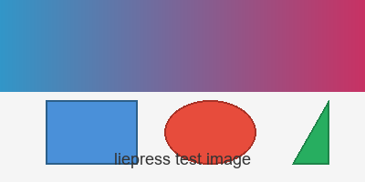

# liepress

**liepress** 是一个基于 Rust 的 Markdown / HTML 文档转换工具，支持 CSS 样式定制，输出 PDF、SVG、PNG、HTML、DOCX 格式。

- 作者：zzzdong
- 仓库：<https://github.com/zzzdong/liepress>
- 许可：MIT OR Apache-2.0

---

## 安装

```bash
cargo install liepress
```

或从源码构建：

```bash
git clone https://github.com/zzzdong/liepress
cd liepress
cargo build --release
```

---

## 快速开始

准备一个 Markdown 文件 `doc.md`：

```markdown
# Hello, liepress!

这是一段 **加粗** 和 *斜体* 文本。
```

然后运行：

```bash
liepress -i doc.md -o doc.pdf
```

liepress 会根据 Markdown 内容和 CSS 样式生成文档。输出格式由输出文件扩展名推断（`.pdf`、`.svg`、`.png`、`.html`、`.docx`），也可用 `-f` 显式指定。

---

## 文本样式

普通段落文本。**加粗文本**，*斜体文本*，***加粗斜体***，~~删除线文本~~。

行内 `code` 和行内代码块 `let x = 1;`。

这是 <span style="color: red;">红色 span 文字</span>，<span style="font-weight: bold;">加粗 span</span>，<span style="font-size: 16pt;">放大字号 span</span>，<span style="text-decoration: line-through;">span 删除线</span>。

---

## 链接与图片

[liepress 仓库](https://github.com/zzzdong/liepress)

带标题的链接：[GitHub](https://github.com/zzzdong/liepress "liepress 项目主页")

> 注意：liepress 支持本地图片文件（相对/绝对路径）和 `data:` URI（base64 内联），
> 不支持远程 URL。将图片放在 Markdown 同级或子目录中引用即可。



---

## 引用块

> liepress 支持多层嵌套引用块。
>
> > 引用内可以包含 **格式化文本**、`代码` 和 [链接](https://example.com)。
> >
> > > 三层嵌套引用也支持。

---

## 列表

无序列表：

- PDF 输出
- SVG 输出
- PNG 输出
  - 基于 vello_cpu 渲染
  - 支持 DPI 配置

有序列表：

1. 解析 Markdown 为 AST
2. 应用 CSS 样式解析
3. 布局引擎生成文档树
4. 渲染后端输出目标格式

任务列表：

- [x] Markdown 解析
- [x] PDF 输出
- [x] SVG 输出
- [x] PNG 输出
- [ ] 在线演示页面

---

## 代码块

无语言标识的代码块：

```
echo "Hello, liepress!"
```

Rust 代码块：

```rust
use std::fs;

use liepress::{ConvertOptions, PageConfig, markdown_to_pdf};

fn main() {
    let md = "# Hello\nThis is **liepress**.";
    let options = ConvertOptions::default()
        .with_page_config(PageConfig {
            width: Some(210.0),
            height: Some(297.0), // A4 纵向
            ..PageConfig::default()
        })
        .with_font_family(&["serif"]);

    let pdf = markdown_to_pdf(md, &options).unwrap();
    fs::write("output.pdf", pdf).unwrap();
}
```

Python 代码块：

```python
from liepress import Converter  # 假设的 Python 绑定

converter = Converter()
converter.load_css("style.css")
converter.convert("doc.md", "output.pdf")
```

---

## 表格

| 输出格式 | 渲染后端 | 状态 | 优先级 |
|:--------|:---------|:----:|:------:|
| PDF     | krilla   | ✅ 完成 | 高 |
| SVG     | 手写 XML | ✅ 完成 | 中 |
| PNG     | vello_cpu | ✅ 完成 | 低 |
| HTML    | 语义序列化 | ✅ 完成 | 中 |
| DOCX    | docx-rs   | ✅ 完成 | 低 |

---

## 分隔线

---

# 1. 架构概述

> 本章介绍 liepress 的核心架构设计。

## 1.1 分层渲染管线

liepress 采用 **分层架构**，将文档处理分为独立的层：

| 层 | 输入 | 输出 | 职责 |
|:----|:----|:----|:-----|
| DOM 层 | Markdown / HTML | HtmlDocument | 解析为统一的 HTML 文档树 |
| 样式 AST | HtmlDocument + CSS | Styled AST | 计算样式，生成带样式的语法树 |
| 文档布局 | Styled AST | Document | 计算每个元素的位置和尺寸（不分页） |
| 渲染/输出 | Document / AST | PDF/SVG/PNG、HTML/DOCX | 将布局结果绘制/序列化为最终输出 |

其中 PDF、SVG、PNG 消费精确布局的 `Document`；HTML、DOCX 作为流式输出直接消费样式 AST。

### 1.1.1 关键设计决策

```rust
// liepress 核心类型示意（通过 builder 风格构造）
let opts = liepress::ConvertOptions::new()
    .with_font_family(&["Noto Sans CJK SC", "serif"])
    .with_css("h1 { color: #4a90d9; }")
    .with_strict(true)
    .with_auto_font(true);

// 顶层自由函数直接返回字节/字符串，由调用方落盘
let pdf = liepress::markdown_to_pdf(md, &opts).unwrap();
let svg = liepress::markdown_to_svg(md, &opts).unwrap();
let png = liepress::markdown_to_png(md, &opts).unwrap();
let docx = liepress::markdown_to_docx(md, &opts).unwrap();
let html = liepress::markdown_to_html_document(md, None, None, None);
```

#### 1.1.1.1 设计权衡

> **要点总结**：
>
> - 选择 Rust 语言以获得 **高性能** 和 **内存安全**
> - CSS 样式系统支持 **选择器权重计算** 和 **样式层叠**
> - PDF/SVG/PNG 共享同一布局引擎（`Document`）
> - HTML/DOCX 作为流式输出直接消费样式 AST

---

## 输出示例

以下是由 liepress 生成的 SVG 输出结构示意：

```svg
<svg width="595" height="842" xmlns="http://www.w3.org/2000/svg">
  <text x="50" y="80" font-size="24" font-weight="bold">Hello</text>
  <text x="50" y="120" font-size="10.5">This is liepress.</text>
</svg>
```

---

## center 居中容器

<center>liepress</center>

---

## 内联 style 标签样式

<style>
.highlight {
    background-color: #ffffcc;
    padding: 2pt 4pt;
    border-radius: 2pt;
}
.warning {
    color: #cc0000;
    font-weight: bold;
}
.tagline {
    color: #4a90d9;
    font-style: italic;
    font-size: 14pt;
}
</style>

自定义样式测试：<span class="highlight">高亮文本</span>，<span class="warning">警告文本</span>，<span class="tagline">styled tagline</span>。

---

## 混合排版示例

这是 **加粗**、*斜体*、`代码`、<span style="color: red;">红色文字</span> 和 [链接](https://example.com) 混合在一起的段落。

> 引用块中混合 **格式化文本**、<span style="color: blue;">蓝色 span</span> 和 `行内代码`。

- **粗体列表项** 包含 <span style="background: #eee;">高亮 span</span>
- *斜体列表项* 包含 ~~删除线文本~~
- 普通列表项包含 `行内代码`

---

<center>

---

*liepress v0.1.0-beta — 用 Markdown 生成文档*

</center>